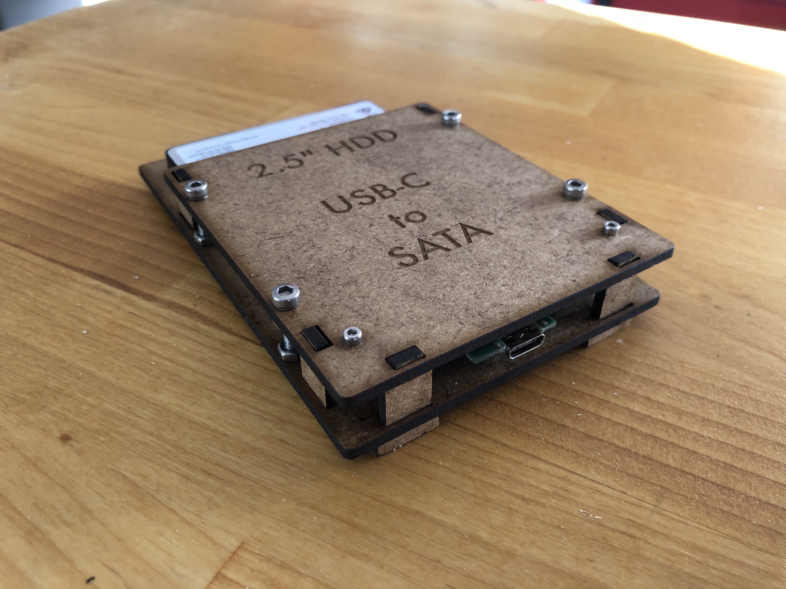

*(Français plus bas)*

USB-C to 2.5" SATA external enclosure
===

Description
==

The USB-C to 2.5" SATA external enclosure is a laser cut 2.5" HDD external enclosure. This enclosure can accept up to 9mm height hard-drives.

Source-tree
==

* dxf : file for your laser cutter
* photos : some photos

Bill of materials
==
* 30x20x3mm HDF (https://en.wikipedia.org/wiki/Hardboard) sheet
* Seagate E481033 2H2S3M PCB controller (mine was salvaged from a broken enclosure)
* 4 3x20 bolts
* 2 2x20 bolts
* 12 M3 nuts
* 12 M2 nuts

Who am I ?
==

* Arnaud Boudou ([@aboudou@pouet.chapril.org](https://pouet.chapril.org/@aboudou))
* Software developper at [Arnaud Boudou Conseiil](https://boudou-conseil.io)

Boitier externe USB-C vers SATA 2.5"
===

Description
==

Le boitier externe USB-C vers SATA 2.5" est un boitier externet pour disque dur 2.5" découpé au laser. Ce boitier est compatible avec des disques durs faisant jusqu'à 9mm d'épaisseur.

Source-tree
==

* dxf : fichier pour votre découpeuse laser
* photos : quelques photos

Liste de courses
==
* Plaque de HDF (https://fr.wikipedia.org/wiki/Panneau_de_fibres_dur) en 30x20x3mm
* Un controleur Seagate E481033 2H2S3M (le mien a été récupéré d'un boitier externe cassé)
* 4 vis 3x20
* 2 vis 2x20
* 12 écrous M3
* 12 écrous M2

Qui suis-je ?
==

* Arnaud Boudou ([@aboudou@pouet.chapril.org](https://twitter.com/boudouarnaud))
* Développeur logiciel chez [Arnaud Boudou Conseil](https://boudou-conseil.io)
